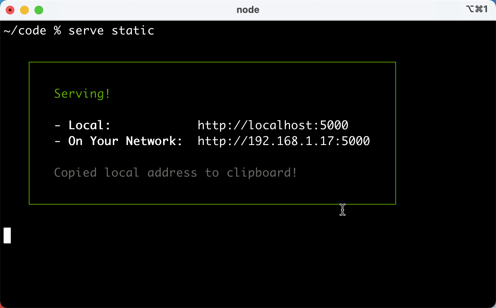
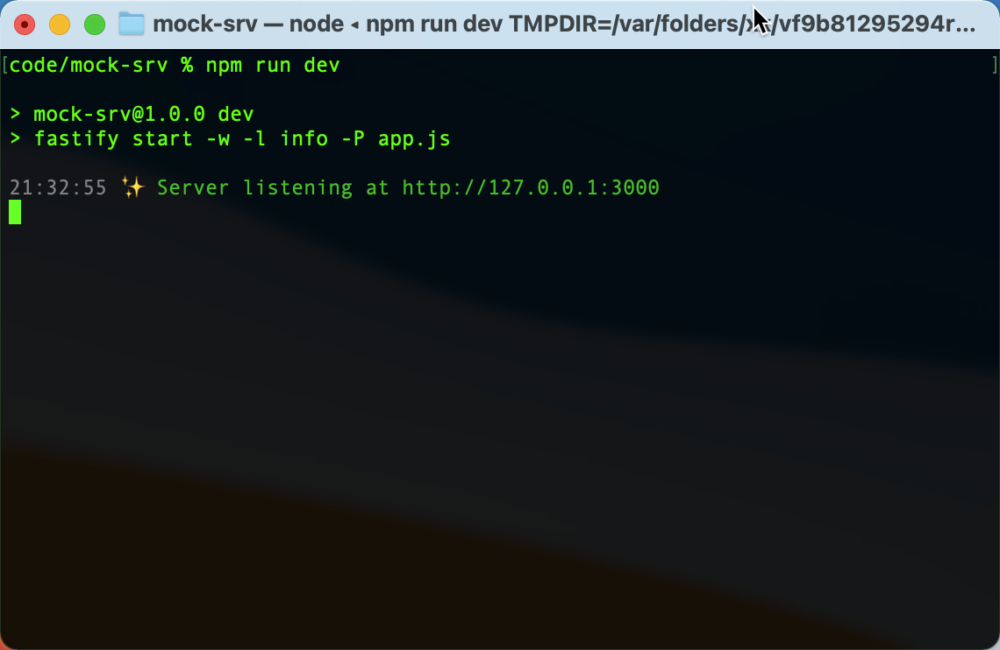
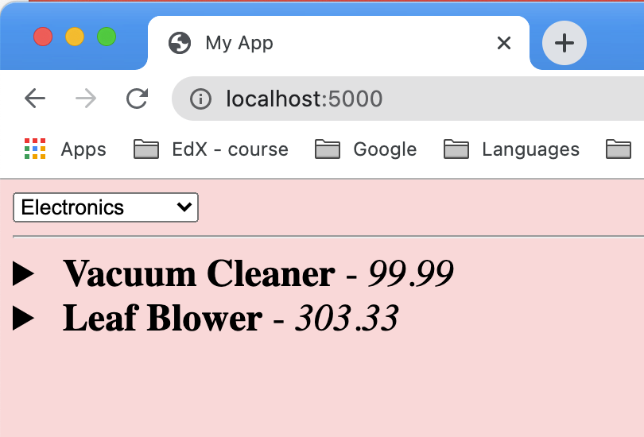

# Introduction-to-Node.js
This is a class by LinuxFoundationX (edX) on Node.js  
# Chapter 2

## Fastify server, mocking GET routes
The name of the folder sets the path prefix for the route. So if we set up a GET `/foo` route with 
    `fastify.get('/foo', …)` 

within the folder `/confectionery/`. 

The route becomes: `/confectionery/foo` 

Can rename the folder to change the route.

## Fastify server, mocking POST routes

Replace 'get' with 'post'.

## Mock Server Folder
Make server folder same level as project.
`cd` into it and run command
`npm init fastify`
to create the server.

## Cross-site-scripting

Need `fastify-cors` because the mocking server is in a different folder than the http server.

Register it, e.g. `fastify.register(cors)`

Fastify creates a *plugin*.

## Starting servers
### http server
Start the http server *from its parent folder*

Assume folder structure: `~/code/static`  
Change into **parent** folder: `~/code`  
Run command: `serve static`  

### fastify mock server
Assume folder structure: `~code/mock-srv`  
Change into the **mock** folder: `~/code/mock-srv`  
Run command: `npm run dev`

### mocked web page
